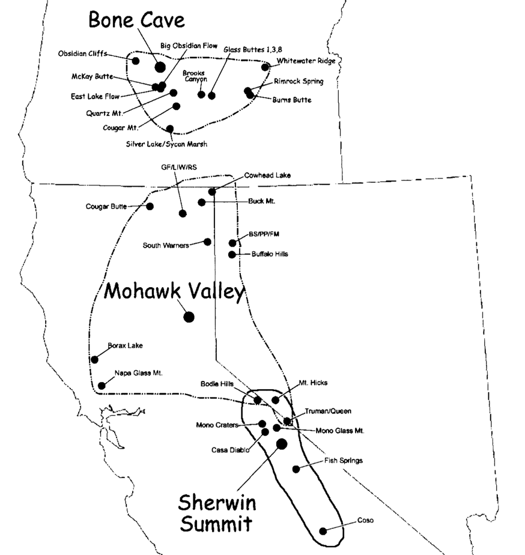

```{r setup, include=FALSE}
knitr::opts_chunk$set(echo = TRUE)
library(dplyr)
library(janitor)
library(emo)
library(knitr)
library(kableExtra)

colorize <- function(x, color) {
  if (knitr::is_latex_output()) {
    sprintf("\\textcolor{%s}{%s}", color, x)
  } else if (knitr::is_html_output()) {
    sprintf("<span style='color: %s;'>%s</span>", color,
      x)
  } else x
}
```

# Introduction 

One of an archaeologist's most common challenges is struggling with an uncooperative dataset. Sometimes you might have no-oone to blame but yourself, and other times you may be working with existing (published/inherited/"legacy") data. They might be causing trouble for all sorts of reasons: for example, because they are full of typographical errors, because recording conventions were inconsistent, because they are formatted in a way that R finds inconvenient, or because the units of analysis in which you're interested differ from those of the initial collector of the data.

Because this is such a common problem, data *cleaning* and data *wrangling* are fantastically useful skills. The former comprises everything from making column names consistent so that they're easily manipulable, to removing empty rows, to standardizing classifications; the latter commonly involves renaming, recoding, summarizing, and reshaping data.

```{r echo = F, out.width='30%', out.extra='style="float:right; padding:10px"'}

```

What you'll find here are the tools you need to get started with data cleaning and manipulation - concepts, plus an introduction to the very useful (and often irritating) **dplyr** package. We'll cover:

-   harvesting data (from importing .csvs to reading MSExcel files and GoogleSheets to scraping .pdfs)
-   naming, renaming, and recoding
-   summarizing and reshaping (wide to long data [and back again?])

# Acquiring data

## Reading tabular data

You can probably figure out a way to read just about any tabular data into R. We'll look here at a couple of very straightforward but useful ones, and one slightly more clever one - but if you encounter messier data, be persistent.

We've loaded the **dplyr** package above, and we'll add the **readxl**, **googlesheets4** packages here. They do exactly what you'd expect from the names. Since you're already familiar with `read.csv()` and `read.delim` from Base R, we'll skip those here. As it is wont to do, the **tidyverse** reinvents the wheel and adds a `read_csv()` function in the **readr** package. It it similar to the Base R function most of the time, but sometimes better at parsing files, and by default produces a `tibble`, which is a **tidyverse** version of a data frame. For a guide to data import, see this [cheatsheet](https://rstudio.github.io/cheatsheets/html/data-import.html).

You'll find an .xlsx version of a table modified from Drennan's [-@drennan2009] Table 6-1 [here](data/Drennan_2009_Table6-1_b.xlsx), and a google sheet version [here](https://docs.google.com/spreadsheets/d/1bnZ7QSc1hjQ1HYQwXFNUHY3Yf4DLiNw4B68gl3texJc/edit?usp=sharing). If you examine the spreadsheet versions, you'll note that some information is stored on a second sheet; you'll want that also, so we'll import two objects (`drennan6.1b` and `drennan6.1b_2`). Try importing both .xlsx and google sheet just to see that it's possible to do either, but then pick one - you only need one version each of `drennan6.1b` and `drennan6.1b_2`.

Note also that some information is encoded by highlighting cells. How might you alter the spreadhseet to make that information capturable [you needn't do this; just think about it]?

To note:

-   .csv is the most easily and reliably readable tabular format, but will not save formulas, colored cells, multiple sheets, etc...but when you read an .xlsx file you can't easily capture that info anyway...so it's not good practice to store information that way.
-   For an .xlsx or a google sheet, you may to have specify which range of cells and/or which sheet you want.

For `googlesheets4::read_sheet()` to work, you may have to authenticate. If you don't get prompted and you get authentication errors, try running `gs4_auth()` in the console.

```{r read_spreadsheets, message=F}
library(readxl)
library(googlesheets4)

drennan6.1b <- read_xlsx("data/Drennan_2009_Table6-1_b.xlsx") #defaults to sheet 1
drennan6.1b_2 <- read_xlsx("data/Drennan_2009_Table6-1_b.xlsx", sheet = 2) 

drennan6.1b <- read_sheet("https://docs.google.com/spreadsheets/d/1bnZ7QSc1hjQ1HYQwXFNUHY3Yf4DLiNw4B68gl3texJc/edit?usp=sharing")
drennan6.1b_2 <- read_sheet("https://docs.google.com/spreadsheets/d/1bnZ7QSc1hjQ1HYQwXFNUHY3Yf4DLiNw4B68gl3texJc/edit?usp=sharing", sheet = 2)
```

Pick your favorite of the versions of this table and write it to an object. Because these data are clean, there's no need to fuss with them much - but we may want to rearrange them a bit, and probably will find it convenient to convert some of the columns into factors for that reason. See 'Data Cleaning'.

## Scraping .pdfs

```{r echo = F, out.width='20%', out.extra='style="float:left; padding:10px"'}
knitr::include_graphics("imgs/tabula.png")
```

[**Tabula**](https://tabula.technology/)

We'll look at pages 589-592 from Eerkens and colleagues 2007 [paper]((https://www.cambridge.org/core/journals/american-antiquity/article/abs/reduction-strategies-and-geochemical-characterization-of-lithic-assemblages-a-comparison-of-three-case-studies-from-western-north-america/261B64DA3C2F3D77B4D480E169778CD6)) [@eerkens2007], which contains three tables of interest. Scrape all three - you can find a .pdf of the relevant pages [here](data/Eerkens_2007_American_Antiquity_extract.pdf) - using **tabula** (there is a **tabulapdf** package that provides an interface through R...but it generally doesn't work as well). Save the three resulting .csv files in your 'data' folder. Examine the results, and you'll find that the scraping isn't perfect: characters may be misinterpreted (empty spaces and placeholders tend to cause trouble) and not everything winds up exactly where it should. This is generally easiest to fix by opening the .csv in MSExcel or something like it and editing there, comparing to the .pdf table to make sure you get accurate output.

Once you have the three tables looking as they should, read them in with `read.csv()` or `read_csv()`. If Tabula isn't cooperating and/or you want to learn less, you can download .csv versions ([Table 1](data/Eerkens_2007_Table1.csv), [Table 2](data/Eerkens_2007_Table2.csv), and [Table 3](data/Eerkens_2007_Table3.csv)).

```{r read_csv, message = F}
library(readr)

eerk_tab1 <- read_csv("data/Eerkens_2007_Table1.csv")
eerk_tab2 <- read_csv("data/Eerkens_2007_Table2.csv")
eerk_tab3 <- read_csv("data/Eerkens_2007_Table3.csv")
```

It's *always* a good idea to have a look at your data before you do anything.

```{r}
eerk_tab1
```

It's immediately clear that we have some work to do. There are two different ways of indicating no data ("NA" and "-"), there are still a few typos, and it's not obvious which site these data are from.

What we want to do is tidy these tables up, and combine them into a single table that includes a variable for site (the captions indicate that Table 1 is material from Sherwin Summit, Table 2 from Mohawk Valley, and Table 3 from Bone Cave). Those desires leads us to...

# Cleaning data

A few common data-cleaning tasks:

-   adding and removing columns
-   converting character columns to factors

We'll do these the **tidyverse** [`r emo::ji("face with rolling eyes")`] way, using `pipes` (`%>%`), since we're going to use the **dplyr** package and most of the examples you'll find in the wild do so (for a handy **dplyr** reference, see this [cheatsheet](https://rstudio.github.io/cheatsheets/html/data-transformation.html)). Note that even using pipes, if you don't write the result to an object (often overwriting the one that you feed into the pipe), it will be ephemeral. So, `drennan6.1b <- drennan6.1b %>%` is more likely to be useful than just `drennan6.1b %>%`.

## Column/variable management

Note that (most of the time) functions from the **tidyverse** allow selection of columns without using the familiar base R `object$column` syntax. Instead, once an object has been pushed into a pipe (`%>%`), its columns can be called by name, without quotation marks. This has the advantage of saving typing, but does make code a bit harder to read.

### Removing columns with `select()`

Unless we've specified which cells we want with the `range =` argument when reading in the sheet, Table 6.1b has some extraneous columns produced because R detected text outside of the first four and expanded the range accordingly.

```{r selecting}
drennan6.1b %>% select(Site:Unincised)

#or the inverse
drennan6.1b <- drennan6.1b %>% select(-c(`...5`, `...6`, `...7`)) 
#where column names have punctuation, enclose them in ``
```

### Changing column classes and adding columns with `mutate()`

The `mutate()` function can be used to modify existing columns by simply overwriting them.

```{r mutating}
drennan6.1b %>% mutate(Site = factor(Site), Unit = factor(Unit))

#or, more efficiently where multiple columns are involved
drennan6.1b <- drennan6.1b %>% mutate(across(Site:Unit, as.factor))
```

Mutate can also be used to create new columns, as assigning to `$` would (but remember that piping is ephemeral if you're not writing to an object).

```{r mutating-cont}
drennan6.1b <- drennan6.1b %>% mutate(PropIncised = Incised/(Incised + Unincised))
```

## Putting it into practice

Now that you have seen how this works, let's tidy up the Eerkens et al. tables so that we can use them. Looking at them, we'll need to:

-   make sure that no-data values are `NA`,
-   correct typos,
-   rename columns, making sure that they match between tables,
-   remove marginal totals,
-   add a 'Site' column, and
-   make sure that column classes are as we'd like.

Below I'll do this with Eerkens et al. 2007 Table 1; you'll need to do the equivalent with Table 2 and Table 3 so that we can combine all three.

We'll start by defining the no-data values. I find the **dplyr** syntax here a bit opaque...but it's undeniably effective.

```{r defineNA}

eerk_tab1 %>% replace(. == "-", NA)

```

`r colorize("Do the same for Eerkens et al. 2007 Table 2 and Table 3.", "orange")`

```{r echo = F}
eerk_tab2 <- eerk_tab2 %>% replace(. == "-", NA)
  

eerk_tab3 <- eerk_tab3 %>% replace(. == "-", NA)
```

We can "recode" to deal with typos (or any other values that we'd like to change). This used to be handled in **dplyr** by a function called - sensibly - `recode()`...but that has been replaced by one called `case_match()`. Although you can still use `recode()`, we'll try to keep up with the times by using `case_match()` (`case_when()` also works for this).

```{r case_matching}

eerk_tab1 <- eerk_tab1 %>% mutate(`Source Artifact` = case_match(`Source Artifact`,
                         "FormalT ools" ~ "Formal Tools",
                         .default = `Source Artifact`
                         ))

```

The other two Eerkens tables don't seem to need any recoding, so we can move on to the column names. Looking at the data frames and/or using `colnames()` will make clear that there are both typos and abbreviations in the column names. The former are obviously mistakes; the latter imposed by the formatting limitations of published tables. Fortunately we can refer to the full names on the published map. Since "BS/PP/FM" and "GF/LIW/RS" are lumping multiple nearby source and the full lists ("Bordwell Spring, PintoPeak,Fox Mountain, and Hart Mountain", and "Grasshopper Flat, Lost Iron Well, and Red Switchback") would be clunky column names, we'll leave them as-is.



```{r renaming}
#rename() syntax is "NewName" = "OldName"
#unlike recode(), only specified names will change

eerk_tab1 <- eerk_tab1 %>% rename("Mono Glass Mountain" = "Mono GlassMtn.",
                                  "Truman/Queen" = "Queen")

eerk_tab2 <- eerk_tab2 %>% rename("Buffalo Hills" = "Buf. Hills",
                                  "South Warners" = "South War.",
                                  "BS/PP/FM" = "BS PP FM",
                                  "GF/LIW/RS" = "GF LIW RS", 
                                  "Cowhead Lake" = "Cow. Lake",
                                  "Cougar Butte" = "Coug Butte",
                                  "Buck Mountain" = "Buck Mtn.",
                                  "Napa Glass Mountain" = "Napa",
                                  "Mount Hicks" = "Mt. Hicks",
                                  "Truman/Queen" = "Queen"
                                  )
```

`r colorize("Do the same for Eerkens et al. 2007 Table 3.", "orange")`

```{r echo = F}
eerk_tab3 <- eerk_tab3 %>% rename("Obsidian Cliffs" = "Obs. Cliff",
                                  "McKay Butte" = "McK Butte",
                                  "Big Obsidian Flow" = "Big Obs.",
                                  "Quartz Mountain" = "Qtz. Mtn.", 
                                  "Cougar Mountain" = "Coug. Mtn.",
                                  "Brooks Canyon" = "Brooks Cyn.",
                                  "Rimrock Spring" = "Rimr. Spring",
                                  "Whitewater Ridge" = "Whit. Ridge",
                                  "Glass Buttes" = "Glass Butte",
                                  "East Lake Flow" = "East Lake",
                                  "Burns Butte" = "Burn Butte"
                                  )
```

As you'll have noticed above, column names with punctuation can be a hassle (need to be enclosed in tickmarks [`]).  The **janitor** package ("simple little tools for examining and cleaning dirty data") streamlines the standardization of these names (the`case=\` argument controls whether you'll get "Source Artifact", "source_artifact", or "SourceArtifact", etc.).

```{r janitor}
library(janitor)

clean_names(eerk_tab1, case = "snake")

#or piping
eerk_tab1 <- eerk_tab1 %>% clean_names(case = "snake")
```

`r colorize("Do the same for Eerkens et al. 2007 Table 2 and Table 3.", "orange")`

```{r echo = F}
eerk_tab2 <- clean_names(eerk_tab2, case = "snake")
eerk_tab3 <- clean_names(eerk_tab3, case = "snake")
```

The tables have row and column totals included, but since we're going to combine them these will just get in the way. We already used `select()` to remove columns using **dplyr** (and you can do so just as easily by indexing using `[`); we can also use the `filter()` function to remove rows.

```{r removing}
eerk_tab1 %>% select(-totals)
eerk_tab1 %>% filter(source_artifact != "Totals")

#or chain those together with pipes
eerk_tab1 <- eerk_tab1 %>% select(-totals) %>% filter(source_artifact != "Totals")
```

`r colorize("Do the same for Eerkens et al. 2007 Table 2 and Table 3.", "orange")`

```{r echo = F}
eerk_tab2 <- eerk_tab2 %>% select(-totals) %>% filter(source_artifact != "Totals")
eerk_tab3 <- eerk_tab3 %>% select(-totals) %>% filter(source_artifact != "Totals")
```

Each of the three tables contains information from a separate site, but the site name is in the table caption, not included as a variable. We can add an populate a column in **dplyr** using `mutate()`.

```{r newcol}
eerk_tab1 <- eerk_tab1 %>% mutate(site = "Sherwin Summit")
```

`r colorize("Do the same for Eerkens et al. 2007 Table 2 and Table 3.", "orange")`

```{r echo=F}
eerk_tab2 <- eerk_tab2 %>% mutate(site = "Mohawk Valley")
eerk_tab3 <- eerk_tab3 %>% mutate(site = "Bone Cave")
```

We can also use `mutate()` to alter column classes. We want to make sure, in particular, that our counts are 'numeric' rather than 'character' variables (`read_csv()` is likely to have guessed the to be character variables if it found *anything* non-numeric in them). We can do this efficiently by combining `across()` with `mutate()`. Referring to column names in code makes clear how useful **janitor**'s `clean_names()` function is (and how convenient "snake" case is for lazy typists).

```{r as-numeric, warning = F}
eerk_tab1 <- eerk_tab1 %>% mutate(across(casa_diablo:coso, as.numeric))
```

`r colorize("Do the same for Eerkens et al. 2007 Table 2 and Table 3.", "orange")`

```{r echo=F}
eerk_tab2 <- eerk_tab2 %>% mutate(across(buffalo_hills:truman_queen, as.numeric))
eerk_tab3 <- eerk_tab3 %>% mutate(across(obsidian_cliffs:whitewater_ridge, as.numeric))
```

We might also want to turn some of our character variables into factors, but if we plan to combine the tables it's usually safest to do that *after* combining.

# Wrangling data

One common task is to reformat and/or integrate information that has been stored inconveniently. Sometimes this involves combining or splitting columns because we're unsatisfied with how data have been recorded. Other times this is because the data formats for recording, communicating, and analyzing data match rather imperfectly. Very often it's sensible and efficient to *record* data in *wide format* (each row a case containing observations about that case stored in columns), *review* and/or *communicate* it in *summary* format (cased grouped by some shared value of a given variable), and *analyze* it in *long* format (each row a unique combination of case, variable, and value).

In the case of Table 6.1b, there's information stored in the second sheet that we might like to include in our table. Because there's not much of it, we can do this manually, by using `case_when()` to populate a new column . We'll also explore automating the process, which you would want to do with there were 30 rows rather than 3.

## `case_when()`

First we'll use **dplyr**'s `case_when()` function, which is effectively a version of `if_else()`. We'll combine it with `mutate()` to make a new column, and then populate that column depending on the value associated in another table. What we're doing in R working out way down the rows of Table 6.1b, checking the site, then looking at Table 6.1b Sheet 2 to see what period that site belongs to, and filling that information in a new column.

```{r case_when}
drennan6.1b_2

drennan6.1b %>% mutate(Period = case_when(
  Site == "Oak Grove" ~ "Middle Formative",
  Site == "Maple Knoll" ~ "Middle Formative",
  Site == "Cypress Swamp" ~ "Late Formative"
))

#repeat for area
drennan6.1b %>% mutate(Area = case_when(
  Site == "Oak Grove" ~ 2.2, #numeric so shouldn't be in ""
  Site == "Maple Knoll" ~ 2.9,
  Site == "Cypress Swamp" ~ 4.1
))

#can also combine these
drennan6.1b %>% mutate(
  Period = case_when(
  Site == "Oak Grove" ~ "Middle Formative",
  Site == "Maple Knoll" ~ "Middle Formative",
  Site == "Cypress Swamp" ~ "Late Formative"),
  Area = case_when(
  Site == "Oak Grove" ~ 2.2, #numeric so shouldn't be in ""
  Site == "Maple Knoll" ~ 2.9,
  Site == "Cypress Swamp" ~ 4.1
))
```

## `left_join()`

Note that, as above, without a `<-` we are not saving our new, improved object. Not to worry - we'll produce it again - more efficiently - and save that. To do so we'll use a *join*, which updates one table based on information in another, using shared values to define a relationship. There are multiple types of joins (inner/outer, left/right/full) that can be carried out in various ways (see `?join`), and their implementation can get tricky. We'll use a left join (`left_join()`), which takes the first table ('x'), and searches a second table ('y') for matching values in shared (or specified) columns. That is, if both `x` and `y` have a column `z`, `left_join()` searches `x$z`, and if a value of `"a"` is present in both `x$z` and `y$z`, it takes whatever other information is in that row of `y` and appends it to the matching row in `x`. That's probably hard to follow in the abstract, but have a look at how it works:

```{r joining, message=F}
drennan6.1b %>% left_join(drennan6.1b_2, by = "Site")

#if we don't specify `by=`, `left_join()` will guess based on column names
drennan6.1b <- drennan6.1b %>% left_join(drennan6.1b_2)
```

## `separate()`

Suppose that we sometimes want to lump all of these sites as belonging to the Formative Period, and other times we want to separate according to whether they're Middle Formative or Late Formative? This would be simpler if we had a 'Period' column and a second 'Subperiod' column. There's a convenient function for this is the **tidyr** package (another of the tendrils of the tidyverse).

```{r}
library(tidyr)
drennan6.1b %>% separate(Period, into = c("Subperiod", "Period"), sep = " ")
```

## `bind_rows()`

In the case of the Eerkens et al. 2007 tables, joining is not what we want - the tables encode information about different sites, so we don't want to take information from one table and fill it in to rows of another. Rather, we want to combine the tables by adding rows, and filling in columns with empty values where one table has a column and another does not.

```{r bind_rows}

eerk_comb <- bind_rows(eerk_tab1, eerk_tab2, eerk_tab3)

#reorder columns of result

eerk_comb <- eerk_comb %>% relocate(site, source_artifact, casa_diablo:whitewater_ridge)
```

Now we can convert character columns to factors if appropriate.

```{r}
eerk_comb %>% mutate(site = factor(site), 
                     source_artifact = factor(source_artifact))
```

## `group_by()` and `summarize()`

Summarizing needs - logically - a function that will *summarize* multiple inputs in one. Keep in mind that you are squishing the values of many cells in the first table into a single cell in the second, so `summarize()` will need some function with which to do so (sum, mean, median, etc).

```{r summarizing}
#grouping and summarizing
drennan6.1b %>% group_by(Site) %>% summarize(Incised = sum(Incised), 
                                             Unincised = sum(Unincised),
                                             Units = length(Unit))

```

We can combine `summarize()` and `across()` to perform the same summary operation on multiple columns. Note that we may need to include an `na.rm = T` argument if our sums are likely to include `NA` values and we want to treat those as 0s.

```{r summarize-across, warning=F}
eerk_bysite <- eerk_comb %>% group_by(site) %>% 
  summarize(across(casa_diablo:whitewater_ridge, sum, na.rm = T))

eerk_bysite
```

We might also want to consider how many sources contribute flakes in each category. In this case we'll use an unholy mix of **dplyr** and Base R syntax. Don't tell.

```{r}

eerk_comb <- eerk_comb %>% 
  mutate(sources_represented = rowSums(is.na(eerk_comb[,3:31]) == F))
                       
```

This makes it interesting to summarize by other factors than site.

```{r}
eerk_comb %>% group_by(source_artifact) %>% 
  summarize(source_diversity = mean(sources_represented))
```

## `pivot_wider()` and `pivot_longer()`

We can also add a bit more data to the mix, in the form of Euclidean distances from sites to obsidian sources.

```{r message=F}
eerk_dist <- read_csv("data/Eerkens2007_distances.csv")
```

These data are of interest because Eerkens and colleagues argue that obsidians that are more and less difficult to procure will not only be more and less common, but also differently represented amongst different kinds of artifacts. These data are, however, in a form that is inconvenient, and in a way that can't be addressed by simple summary. We could more easily make sense of a table that has, instead of one row for each unique combination of site and source, one row for each *site*, a column for each source, and a distance in each cell. Moving between these options is commonly called *pivoting* a table. The tidyverse functions for this are `pivot_longer()` and `pivot_wider()`, from the **tidyr** package. The `pivot` vocabulary and syntax are often incomprehensible, but it's possible to follow the examples in the vignette that accompanies the package (try `vignette("pivot")`; many packages include demos ["vignettes"] that are often more obviously helpful than the abstracted info provided by `?`).

```{r}
library(tidyr)

eerk_dist_summ <- eerk_dist %>% pivot_wider(names_from = Source, 
                                            values_from = `Euclidean Distance`)
```

Let's reverse the process, just to see `pivot_longer()` in action. Here we tell the function to do this with every column except the first one, put the column names in a new column called 'Source', and put the values associated with each combination of site and source in a new column called 'Distance'.

```{r}
eerk_dist_summ %>% pivot_longer(cols = !Site, 
                                names_to = "Source",
                                values_to = "Distance")
```

## Combining information

We have one data frame that tells us how many artifacts of each class came from different sources from the three case-study sites, and another that tells us distances from sites to sources. One thing that we might want is a data frame that gives us distances from sites to *used* sources (since the distances to unused sources are at best irrelevant and at worst confusing).

```{r combining-info}
eerk_dist_summ <- eerk_dist_summ %>% clean_names("snake")

#check that names match
compare_df_cols(eerk_bysite, eerk_dist_summ)

#make a binary table (sources used or not)
eerk_bysite_bin <- eerk_bysite %>% select(-site) %>% replace(.>0, 1)
  
#multiply binary table by distance table
#NA for unused sources
obsid_dist <- mapply("*", eerk_bysite_bin, eerk_dist_summ[,-1]) %>% data.frame() %>%
  mutate(site = eerk_bysite$site) %>% relocate(site, .before = casa_diablo) %>% 
  replace(. == 0, NA)

obsid_dist
```

```{r echo=F, results='hide'}

#work on average distances/artifact class for each site

sherwin <- eerk_comb %>% filter(site == "Sherwin Summit") %>% 
  select(-c(site, source_artifact, sources_represented)) %>% 
  replace(is.na(.), 0)

sherwin_totdist <- mapply("*", sherwin, eerk_dist_summ[3,-1]) %>% rowSums()

eerk_comb %>% filter(site == "Sherwin Summit") %>% 
  select(-sources_represented) %>% adorn_totals("col") %>%
  mutate(average_dist = sherwin_totdist/Total)

#or just average dist of sources represented?

sherwin_sources <- eerk_comb %>% filter(site == "Sherwin Summit") %>% 
  replace(is.na(.), 0) %>% select(where(~ is.numeric(.x) && 
                                          sum(.x) > 0)) %>%
  select(-sources_represented) %>% replace(.>0, 1) 


sherwin_dists <- eerk_dist_summ %>% filter(site == "Sherwin Summit") %>% 
  select(colnames(sherwin_sources)) #combines all artifact types


mapply("*", sherwin_sources, sherwin_dists) %>% replace(.==0, NA) %>%
  rowMeans(na.rm = T)
```

# The payoff

Now that we have the Eerkens et al. 2007 data cleaned and in the form that we'd like, what do we want to *do* with it? For starters, let's admire our combined data table...then we'll compare the diversity of sources for each artifact class across the different sites.

```{r}
eerk_comb %>% kable() %>% kable_classic(bootstrap_options = c("condensed")) %>% 
  scroll_box(width = "800px")
```

## Visualizing the data

The **tidyverse** is a pretty prescriptive place (there are definitely right and wrong ways to do things), and **tidynerds** prefer to do their data visualization using **ggplot** rather than Base R. Since we've been immersed in **dplyr** here, we'll plot that way as well. A few general rules about ggplot:

-   If you only have a little knowledge of both base R and **ggplot**, it's easier to produce elegant plots with **ggplot**...but harder to control them. If you know both reasonably well, you can produce elegant plots with either; for *complex* plots I usually turn to **ggplot**.
-   **ggplot** often demands significant data preparation beforehand so that the data are in the format that **ggplot** expects (long rather than wide). If you're not conversant with **dplyr** this will be maddening. Base R can much more easily be coaxed to plot in ways that work with existing data. 
  - A corollary is that manipulating a **gplot** plot is as likely to involve manipulating the data being plotted as it is to involve manipulating the plot directly.
-   **ggplot** (like the **tidyverse** in general) tends to be pretty *prescriptive*. As with any template, it's a good idea to think about what *you* want, and how well the template matches your desires, rather than just assuming that it's a) right, and b) smarter than you are.

You can of course consult the full **ggplot** [manual](https://ggplot2-book.org/).

```{r}
library(ggplot2)
library(ggstats)
library(RColorBrewer)

eerk_comb_long <- eerk_comb %>% 
  pivot_longer(cols = !c(site, source_artifact, sources_represented), 
                           names_to = "Source",
                           values_to = "Count") %>%
  mutate(Count = case_when(      #replace NAs with 0s
    is.na(Count) == T ~ 0,
    .default = Count
  ))

#how many colors do we need?
unique(eerk_comb_long$Source)
#a lot
mypalette <- colorRampPalette(brewer.pal(12, "Set3"))(length(unique(eerk_comb_long$Source)))

```

```{r}
eerk_comb_long %>% ggplot() +
  geom_bar(aes(x = source_artifact, fill = Source, weight = Count)) +
  scale_fill_manual(values = mypalette) +
  theme_minimal() +
  facet_wrap(vars(site)) +
  guides(x = guide_axis(angle = 60)) +
  labs(x = "")
```

Since we're interested in diversity, proportions are probably going to be more useful than counts.

```{r}
eerk_comb_long %>% ggplot() +
  aes(x = source_artifact, fill = Source, 
                              weight = Count, by = source_artifact) +
  scale_fill_manual(values = mypalette) +
  geom_bar(position = "fill") +
  theme_minimal() +
  facet_wrap(vars(site)) +
  guides(x = guide_axis(angle = 60)) +
  labs(x = "", y = "Proportion") 

```

If we wanted to make our categories more strictly comparable, we could recode 'Small non-pressure flakes' and 'Small pressure flakes' from Sherwin Summit to produce a 'Small flakes' category (using `case_when()` again).

```{r message=F}
#first recode
eerk_comb_coll <- eerk_comb %>% mutate(source_artifact = case_when(
  source_artifact == "Small Non-pressure Flakes" ~ "Small Flakes",
  source_artifact == "Small Pressure Flakes" ~ "Small Flakes",
  .default = source_artifact
))

#then collapse rows

eerk_comb_coll <- eerk_comb_coll %>% group_by(site, source_artifact) %>% 
  summarize(across(casa_diablo:whitewater_ridge, sum, na.rm = T), 
            sources_represented = mean(sources_represented))


#then pivot again
eerk_comb_coll_long <- eerk_comb_coll %>% 
  pivot_longer(cols = !c(site, source_artifact, sources_represented), 
                           names_to = "Source",
                           values_to = "Count") %>%
  mutate(Count = case_when(      #replace NAs with 0s
    is.na(Count) == T ~ 0,
    .default = Count
  ))
```

And make a new plot.

### Source proportions plotted by artifact type and site {#prop-plot}

```{r}
eerk_comb_coll_long %>% ggplot() +
  aes(x = source_artifact, fill = Source, 
                              weight = Count, by = source_artifact) +
  scale_fill_manual(values = mypalette) +
  geom_bar(position = "fill") +
  theme_minimal() +
  facet_wrap(vars(site)) +
  guides(x = guide_axis(angle = 60)) +
  labs(x = "", y = "Proportion", 
       title = "Obsidian source representation by artifact type") 
```

We might also consider - as Eerkens and colleagues do - how sources represented relate to distance.

```{r}
obsid_dist_l <- obsid_dist %>% 
  pivot_longer(-site, names_to = "source", values_to = "distance") %>%
  filter(is.na(distance) == F)

obsid_dist_l %>% ggplot() +
  geom_bar(aes(x = site, fill = source, y = distance),
           position = "dodge", stat = "identity") +
  scale_fill_manual(values = mypalette) +
  theme_minimal() +
  labs(x = "", y = "Distance (km)")
```

There are some interesting contrasts apparent that might provide us some good food-for-thought. What if we want to look both at distances-by-site and distances-by-type?

```{r}
#add distances to our long data
eerk_comb_long_dist <- eerk_comb_coll_long %>% rename(source = Source) %>% 
  select(-sources_represented) %>% left_join(obsid_dist_l, by = c("site", "source")) %>% 
  filter(Count > 0)

#then plot, using `facet_wrap()`
eerk_comb_long_dist %>% ggplot() + 
  geom_col(aes(x = source_artifact, y = distance, fill = source),
           position = "dodge") +
  scale_fill_manual(values = mypalette) +
  theme_minimal() +
  labs(x = "", y = "Distance (km)", ) +
  facet_wrap(vars(site)) +
  guides(x = guide_axis(angle = 60)) 
  
#the bar widths are proportional to the number of sources in that group...
#and - because ggplot - can't be changed in any obvious way 
```


```{r echo = F, results='hide'}
eerk_comb_long_dist %>% group_by(site, source_artifact) %>% 
  summarize(avg_dist = sum(distance)/length(distance), wgt_avg_dist = sum(Count*distance)/sum(Count))
#relative magnitudes match Eerkens et al. reasonably well; absolute aren't close
```


## Next steps after exploratory visualization

Generally the point of data visualization is to give you some idea about patterns or relationships in the data that you might explore further. In this case, we've been considering source diversity across artifact types at three different sites, and considering Eerkens and colleagues' test of a behavioral model with the expectation that source diversity should be higher for small flakes.

### Diversity indices

We can examine diversity numerically as well as visually. The Shannon index is one of several tools used for quantifying the diversity of a sample by building on how many varieties there are and what proportion of the total each represents. A maximally rich sample is one with lots of varieties where each comprises a relatively high proportion of of the population.

```{r message = F}
library(vegan)

eerk_comb_long %>% filter(Count > 0) %>% group_by(site, source_artifact) %>%
summarize(shannon_index = diversity(Count))

# note that values are different than those published by Eerkens et al
# but relative relationships the same

```

How do these values compare to your assessment of the [plot](#prop-plot) we created above?

# Resources/Tutorials

You can find any number of guides to data cleaning and manipulation in R, mostly using **tidyverse** and in particular the **dplyr** package. Here are a few archaeology-specific ones:

-   The [*Manipulating, analyzing and exporting data with tidyverse*](https://carpentries-incubator.github.io/R-archaeology-lesson/03-dplyr.html) section of Alison Clarke, François Michonneau, and Auriel Fournier's [*Data Analysis and Visualization in R for Archaeologists*](https://carpentries-incubator.github.io/R-archaeology-lesson/index.html).
-   This [*The Tidyverse for Archaeologists: A Guide for Beginners*](https://benmarwick.github.io/tidyverse-for-archaeology/tidyverse-for-archaeology.html#1) presentation by Ben Marwick.
-   The 'Preparing the Data' chapter of Ben Marwick's [*Archaeological Science with R*](https://benmarwick.github.io/aswr/preparingthedata.html). Note that the book itself is a work in progress...and hasn't been updated in some time.
-   Blake Vernon's [*Quantitative Analysis of Archaeological Data* course](https://kbvernon.github.io/qaad/), particularly [the 'Working with Tables' lab](https://kbvernon.github.io/qaad/labs/06-dataframes-lab.html).

# References
